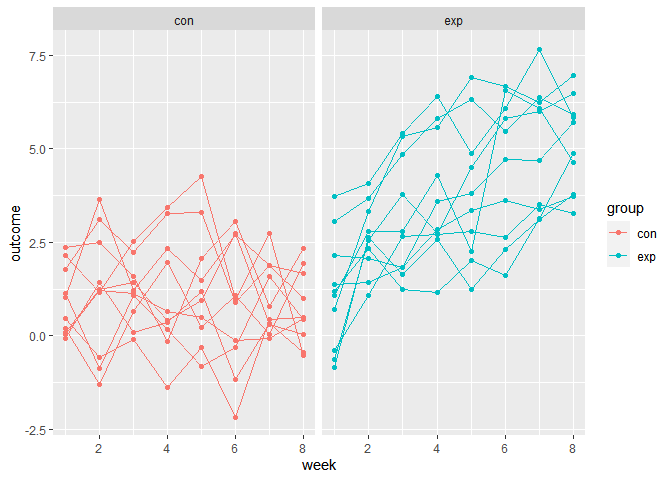
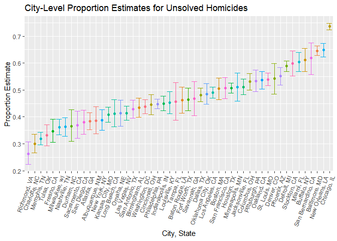
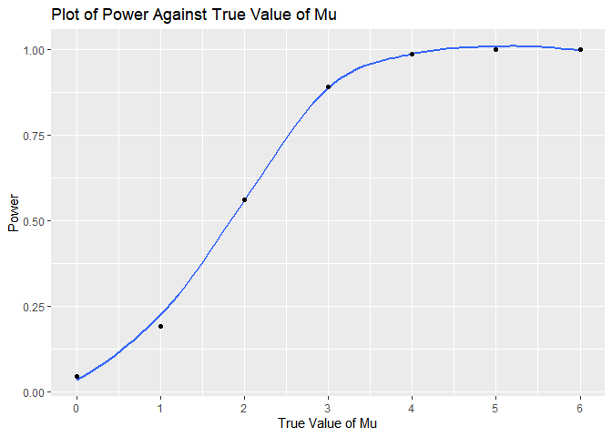
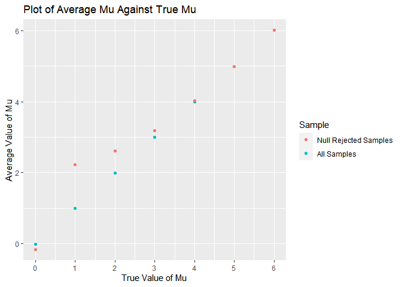

P8105 Data Science I Homework 4
================
Olivia Wang (hw2852)
2022-11-16

In preparation for the problems below, we will load the following
libraries:

``` r
library(tidyverse)
```

    ## ── Attaching packages ─────────────────────────────────────── tidyverse 1.3.2 ──
    ## ✔ ggplot2 3.3.6      ✔ purrr   0.3.4 
    ## ✔ tibble  3.1.8      ✔ dplyr   1.0.10
    ## ✔ tidyr   1.2.0      ✔ stringr 1.4.1 
    ## ✔ readr   2.1.2      ✔ forcats 0.5.2 
    ## ── Conflicts ────────────────────────────────────────── tidyverse_conflicts() ──
    ## ✖ dplyr::filter() masks stats::filter()
    ## ✖ dplyr::lag()    masks stats::lag()

``` r
library(readxl)
library(dplyr)
library(p8105.datasets)
```

# Problem 1

## 1.1 Data Import

Below we import the data in individual spreadsheets contained in
`./data/zip_data/`. To do this, we created a data frame including the
list of all files in that directory and the complete path to each file.
Next, we apply the `map` function over the paths and import data using
the `read_csv` function. Finally, we apply the `unnest` function to the
result of `map`.

``` r
full_df = 
  tibble(
    files = list.files("data/"),
    path = str_c("data/", files)
  ) %>% 
  mutate(data = map(path, read_csv)) %>% 
  unnest(cols = data)
```

    ## Rows: 1 Columns: 8
    ## ── Column specification ────────────────────────────────────────────────────────
    ## Delimiter: ","
    ## dbl (8): week_1, week_2, week_3, week_4, week_5, week_6, week_7, week_8
    ## 
    ## ℹ Use `spec()` to retrieve the full column specification for this data.
    ## ℹ Specify the column types or set `show_col_types = FALSE` to quiet this message.
    ## Rows: 1 Columns: 8
    ## ── Column specification ────────────────────────────────────────────────────────
    ## Delimiter: ","
    ## dbl (8): week_1, week_2, week_3, week_4, week_5, week_6, week_7, week_8
    ## 
    ## ℹ Use `spec()` to retrieve the full column specification for this data.
    ## ℹ Specify the column types or set `show_col_types = FALSE` to quiet this message.
    ## Rows: 1 Columns: 8
    ## ── Column specification ────────────────────────────────────────────────────────
    ## Delimiter: ","
    ## dbl (8): week_1, week_2, week_3, week_4, week_5, week_6, week_7, week_8
    ## 
    ## ℹ Use `spec()` to retrieve the full column specification for this data.
    ## ℹ Specify the column types or set `show_col_types = FALSE` to quiet this message.
    ## Rows: 1 Columns: 8
    ## ── Column specification ────────────────────────────────────────────────────────
    ## Delimiter: ","
    ## dbl (8): week_1, week_2, week_3, week_4, week_5, week_6, week_7, week_8
    ## 
    ## ℹ Use `spec()` to retrieve the full column specification for this data.
    ## ℹ Specify the column types or set `show_col_types = FALSE` to quiet this message.
    ## Rows: 1 Columns: 8
    ## ── Column specification ────────────────────────────────────────────────────────
    ## Delimiter: ","
    ## dbl (8): week_1, week_2, week_3, week_4, week_5, week_6, week_7, week_8
    ## 
    ## ℹ Use `spec()` to retrieve the full column specification for this data.
    ## ℹ Specify the column types or set `show_col_types = FALSE` to quiet this message.
    ## Rows: 1 Columns: 8
    ## ── Column specification ────────────────────────────────────────────────────────
    ## Delimiter: ","
    ## dbl (8): week_1, week_2, week_3, week_4, week_5, week_6, week_7, week_8
    ## 
    ## ℹ Use `spec()` to retrieve the full column specification for this data.
    ## ℹ Specify the column types or set `show_col_types = FALSE` to quiet this message.
    ## Rows: 1 Columns: 8
    ## ── Column specification ────────────────────────────────────────────────────────
    ## Delimiter: ","
    ## dbl (8): week_1, week_2, week_3, week_4, week_5, week_6, week_7, week_8
    ## 
    ## ℹ Use `spec()` to retrieve the full column specification for this data.
    ## ℹ Specify the column types or set `show_col_types = FALSE` to quiet this message.
    ## Rows: 1 Columns: 8
    ## ── Column specification ────────────────────────────────────────────────────────
    ## Delimiter: ","
    ## dbl (8): week_1, week_2, week_3, week_4, week_5, week_6, week_7, week_8
    ## 
    ## ℹ Use `spec()` to retrieve the full column specification for this data.
    ## ℹ Specify the column types or set `show_col_types = FALSE` to quiet this message.
    ## Rows: 1 Columns: 8
    ## ── Column specification ────────────────────────────────────────────────────────
    ## Delimiter: ","
    ## dbl (8): week_1, week_2, week_3, week_4, week_5, week_6, week_7, week_8
    ## 
    ## ℹ Use `spec()` to retrieve the full column specification for this data.
    ## ℹ Specify the column types or set `show_col_types = FALSE` to quiet this message.
    ## Rows: 1 Columns: 8
    ## ── Column specification ────────────────────────────────────────────────────────
    ## Delimiter: ","
    ## dbl (8): week_1, week_2, week_3, week_4, week_5, week_6, week_7, week_8
    ## 
    ## ℹ Use `spec()` to retrieve the full column specification for this data.
    ## ℹ Specify the column types or set `show_col_types = FALSE` to quiet this message.
    ## Rows: 1 Columns: 8
    ## ── Column specification ────────────────────────────────────────────────────────
    ## Delimiter: ","
    ## dbl (8): week_1, week_2, week_3, week_4, week_5, week_6, week_7, week_8
    ## 
    ## ℹ Use `spec()` to retrieve the full column specification for this data.
    ## ℹ Specify the column types or set `show_col_types = FALSE` to quiet this message.
    ## Rows: 1 Columns: 8
    ## ── Column specification ────────────────────────────────────────────────────────
    ## Delimiter: ","
    ## dbl (8): week_1, week_2, week_3, week_4, week_5, week_6, week_7, week_8
    ## 
    ## ℹ Use `spec()` to retrieve the full column specification for this data.
    ## ℹ Specify the column types or set `show_col_types = FALSE` to quiet this message.
    ## Rows: 1 Columns: 8
    ## ── Column specification ────────────────────────────────────────────────────────
    ## Delimiter: ","
    ## dbl (8): week_1, week_2, week_3, week_4, week_5, week_6, week_7, week_8
    ## 
    ## ℹ Use `spec()` to retrieve the full column specification for this data.
    ## ℹ Specify the column types or set `show_col_types = FALSE` to quiet this message.
    ## Rows: 1 Columns: 8
    ## ── Column specification ────────────────────────────────────────────────────────
    ## Delimiter: ","
    ## dbl (8): week_1, week_2, week_3, week_4, week_5, week_6, week_7, week_8
    ## 
    ## ℹ Use `spec()` to retrieve the full column specification for this data.
    ## ℹ Specify the column types or set `show_col_types = FALSE` to quiet this message.
    ## Rows: 1 Columns: 8
    ## ── Column specification ────────────────────────────────────────────────────────
    ## Delimiter: ","
    ## dbl (8): week_1, week_2, week_3, week_4, week_5, week_6, week_7, week_8
    ## 
    ## ℹ Use `spec()` to retrieve the full column specification for this data.
    ## ℹ Specify the column types or set `show_col_types = FALSE` to quiet this message.
    ## Rows: 1 Columns: 8
    ## ── Column specification ────────────────────────────────────────────────────────
    ## Delimiter: ","
    ## dbl (8): week_1, week_2, week_3, week_4, week_5, week_6, week_7, week_8
    ## 
    ## ℹ Use `spec()` to retrieve the full column specification for this data.
    ## ℹ Specify the column types or set `show_col_types = FALSE` to quiet this message.
    ## Rows: 1 Columns: 8
    ## ── Column specification ────────────────────────────────────────────────────────
    ## Delimiter: ","
    ## dbl (8): week_1, week_2, week_3, week_4, week_5, week_6, week_7, week_8
    ## 
    ## ℹ Use `spec()` to retrieve the full column specification for this data.
    ## ℹ Specify the column types or set `show_col_types = FALSE` to quiet this message.
    ## Rows: 1 Columns: 8
    ## ── Column specification ────────────────────────────────────────────────────────
    ## Delimiter: ","
    ## dbl (8): week_1, week_2, week_3, week_4, week_5, week_6, week_7, week_8
    ## 
    ## ℹ Use `spec()` to retrieve the full column specification for this data.
    ## ℹ Specify the column types or set `show_col_types = FALSE` to quiet this message.
    ## Rows: 1 Columns: 8
    ## ── Column specification ────────────────────────────────────────────────────────
    ## Delimiter: ","
    ## dbl (8): week_1, week_2, week_3, week_4, week_5, week_6, week_7, week_8
    ## 
    ## ℹ Use `spec()` to retrieve the full column specification for this data.
    ## ℹ Specify the column types or set `show_col_types = FALSE` to quiet this message.
    ## Rows: 1 Columns: 8
    ## ── Column specification ────────────────────────────────────────────────────────
    ## Delimiter: ","
    ## dbl (8): week_1, week_2, week_3, week_4, week_5, week_6, week_7, week_8
    ## 
    ## ℹ Use `spec()` to retrieve the full column specification for this data.
    ## ℹ Specify the column types or set `show_col_types = FALSE` to quiet this message.

## 1.2 Tidying Data

The result of the previous code chunk is not tidy – data are wide rather
than long, and some important variables are included as parts of others.
Below we tidy the data by applying string manipulations, converting from
wide to long using `pivot_longer`, and selecting relevant variables for
further analysis.

``` r
tidy_df = 
  full_df %>% 
  mutate(
    files = str_replace(files, ".csv", ""),
    group = str_sub(files, 1, 3)) %>% 
  pivot_longer(
    week_1:week_8,
    names_to = "week",
    values_to = "outcome",
    names_prefix = "week_") %>% 
  mutate(week = as.numeric(week)) %>% 
  select(group, subj = files, week, outcome)
```

## 1.3 Generating Spaghetti Plot

Using the tidied data generated above, we can create a spaghetti plot
using `ggplot`, showing individual data, faceted by group.

``` r
tidy_df %>% 
  ggplot(aes(x = week, y = outcome, group = subj, color = group)) + 
  geom_point() + 
  geom_path() + 
  facet_grid(~group)
```

<!-- -->

The plot generated above suggests high within-subject correlation. More
specifically, subjects who start above average end up above average, and
those that start below average end up below average. Subjects in the
control group generally do not change over time, but those in the
experiment group increase their outcome in a roughly linear way.

# Problem 2

Let us begin by importing the CSV file containing *Washington Post’s*
homicide data downloaded from GitHub, and applying the `clean_names`
function. We can then apply the `skim` function to generate a brief data
summary.

``` r
homicide_data = 
  read_csv("./homicide-data.csv") %>% 
  janitor::clean_names()
```

    ## Rows: 52179 Columns: 12
    ## ── Column specification ────────────────────────────────────────────────────────
    ## Delimiter: ","
    ## chr (9): uid, victim_last, victim_first, victim_race, victim_age, victim_sex...
    ## dbl (3): reported_date, lat, lon
    ## 
    ## ℹ Use `spec()` to retrieve the full column specification for this data.
    ## ℹ Specify the column types or set `show_col_types = FALSE` to quiet this message.

``` r
skimr::skim(homicide_data)
```

|                                                  |               |
|:-------------------------------------------------|:--------------|
| Name                                             | homicide_data |
| Number of rows                                   | 52179         |
| Number of columns                                | 12            |
| \_\_\_\_\_\_\_\_\_\_\_\_\_\_\_\_\_\_\_\_\_\_\_   |               |
| Column type frequency:                           |               |
| character                                        | 9             |
| numeric                                          | 3             |
| \_\_\_\_\_\_\_\_\_\_\_\_\_\_\_\_\_\_\_\_\_\_\_\_ |               |
| Group variables                                  | None          |

Data summary

**Variable type: character**

| skim_variable | n_missing | complete_rate | min | max | empty | n_unique | whitespace |
|:--------------|----------:|--------------:|----:|----:|------:|---------:|-----------:|
| uid           |         0 |             1 |   9 |  10 |     0 |    52179 |          0 |
| victim_last   |         0 |             1 |   1 |  20 |     0 |    12687 |          0 |
| victim_first  |         0 |             1 |   1 |  28 |     0 |    16640 |          0 |
| victim_race   |         0 |             1 |   5 |   8 |     0 |        6 |          0 |
| victim_age    |         0 |             1 |   1 |   7 |     0 |      102 |          0 |
| victim_sex    |         0 |             1 |   4 |   7 |     0 |        3 |          0 |
| city          |         0 |             1 |   5 |  14 |     0 |       50 |          0 |
| state         |         0 |             1 |   2 |   2 |     0 |       28 |          0 |
| disposition   |         0 |             1 |  14 |  21 |     0 |        3 |          0 |

**Variable type: numeric**

| skim_variable | n_missing | complete_rate |        mean |         sd |          p0 |         p25 |         p50 |         p75 |          p100 | hist  |
|:--------------|----------:|--------------:|------------:|-----------:|------------:|------------:|------------:|------------:|--------------:|:------|
| reported_date |         0 |             1 | 20130899.16 | 1123419.63 | 20070101.00 | 20100318.00 | 20121216.00 | 20150911.00 | 201511105\.00 | ▇▁▁▁▁ |
| lat           |        60 |             1 |       37.03 |       4.35 |       25.73 |       33.77 |       38.52 |       40.03 |         45.05 | ▁▅▅▇▅ |
| lon           |        60 |             1 |      -91.47 |      13.75 |     -122.51 |      -96.00 |      -87.71 |      -81.76 |        -71.01 | ▃▁▃▇▅ |

The *Washington Post’s* raw homicide data contains **52179 rows** and
**12 columns**. Each row corresponds to one homicide case, and the
following information regarding the homicide are found in each column:

-   Case ID code
-   Reported date
-   Victim identifiers (name, age, race and sex)
-   Location details (state, city, latitude and longitude)
-   Disposition

Based on the output generated above, we can see that there are no
missing values for all variables except for `latitude` and `longitude`.
The `latitude` variable has **60 missing values** and the `longitude`
variable has **60 missing values**.

## 2.1 City-Level Summaries of Homicide Data

#### *Total Homicides per City*

In the following code chunk, we create a new `city_state` variable
(e.g. “Baltimore, MD”) by joining the existing city and state variables
using the `paste` command. Since each row represents a unique homicide
case, we can determine the total number of homicides by counting the
number of observations per city-state pair. We will save the output as a
new data frame, to be used in further analysis.

``` r
homicide_data = homicide_data %>% 
  mutate(city_state = as.character(paste(city, state, sep = ", ")))

total_homicides =
  homicide_data %>% 
  group_by(city_state) %>% 
  summarize(n_obs = n()) %>% 
  arrange(desc(n_obs))
  
knitr::kable(total_homicides, col.names = c('City, State', 'Total Homicides (n)'))
```

| City, State        | Total Homicides (n) |
|:-------------------|--------------------:|
| Chicago, IL        |                5535 |
| Philadelphia, PA   |                3037 |
| Houston, TX        |                2942 |
| Baltimore, MD      |                2827 |
| Detroit, MI        |                2519 |
| Los Angeles, CA    |                2257 |
| St. Louis, MO      |                1677 |
| Dallas, TX         |                1567 |
| Memphis, TN        |                1514 |
| New Orleans, LA    |                1434 |
| Las Vegas, NV      |                1381 |
| Washington, DC     |                1345 |
| Indianapolis, IN   |                1322 |
| Kansas City, MO    |                1190 |
| Jacksonville, FL   |                1168 |
| Milwaukee, wI      |                1115 |
| Columbus, OH       |                1084 |
| Atlanta, GA        |                 973 |
| Oakland, CA        |                 947 |
| Phoenix, AZ        |                 914 |
| San Antonio, TX    |                 833 |
| Birmingham, AL     |                 800 |
| Nashville, TN      |                 767 |
| Miami, FL          |                 744 |
| Cincinnati, OH     |                 694 |
| Charlotte, NC      |                 687 |
| Oklahoma City, OK  |                 672 |
| San Francisco, CA  |                 663 |
| Pittsburgh, PA     |                 631 |
| New York, NY       |                 627 |
| Boston, MA         |                 614 |
| Tulsa, OK          |                 583 |
| Louisville, KY     |                 576 |
| Fort Worth, TX     |                 549 |
| Buffalo, NY        |                 521 |
| Fresno, CA         |                 487 |
| San Diego, CA      |                 461 |
| Stockton, CA       |                 444 |
| Richmond, VA       |                 429 |
| Baton Rouge, LA    |                 424 |
| Omaha, NE          |                 409 |
| Albuquerque, NM    |                 378 |
| Long Beach, CA     |                 378 |
| Sacramento, CA     |                 376 |
| Minneapolis, MN    |                 366 |
| Denver, CO         |                 312 |
| Durham, NC         |                 276 |
| San Bernardino, CA |                 275 |
| Savannah, GA       |                 246 |
| Tampa, FL          |                 208 |
| Tulsa, AL          |                   1 |

The output above reveals a something unexpected in these data: the
homicide data collected by *Washington Post* actually contains data from
**51** distinct cities, as opposed to the 50 originally indicated.
Further analysis of the data reveals that this discrepancy likely arose
due to the fact that there are two cities named Tulsa in different
states: one in Alabama and another in Oklahoma. Although the data from
Tulsa, AL seems to suggest that it may be a typographical error (i.e.,
Tulsa, AL was supposed to be entered as Tulsa, OK) since it reports to
have one single homicide over a decade, it is important for data
analysts to not make any assumptions about the data. Since the raw data
indicates that Tulsa, AL only reported one single homicide, and
therefore has minimal impact on our overall sample size, the data from
Tulsa, AL will be removed for further analysis.

``` r
total_homicides = total_homicides %>% 
  filter(n_obs > 1)
```

#### *Total Unsolved Homicides per City*

To determine the total number of unsolved homicides per city, we can
generate a new binary `unsolved_homicide` variable, which will take on a
value of 1 if the homicide is unsolved (i.e., disposition = “Closed
without arrest” or “Open/No arrest”) and 0 if the homicide is solved
(i.e., disposition = “Closed by arrest”). We will save the output as a
new data frame, to be used in further analysis.

``` r
homicide_data = homicide_data %>% 
  mutate(unsolved_homicide = ifelse(disposition == "Closed by arrest", 0, 1))

unsolved_homicides =
  homicide_data %>% 
  group_by(city_state) %>%
  filter(unsolved_homicide == 1) %>% 
  summarize(n_obs = n()) 

knitr::kable(unsolved_homicides, col.names = c('City, State', 'Unsolved Homicides (n)'))
```

| City, State        | Unsolved Homicides (n) |
|:-------------------|-----------------------:|
| Albuquerque, NM    |                    146 |
| Atlanta, GA        |                    373 |
| Baltimore, MD      |                   1825 |
| Baton Rouge, LA    |                    196 |
| Birmingham, AL     |                    347 |
| Boston, MA         |                    310 |
| Buffalo, NY        |                    319 |
| Charlotte, NC      |                    206 |
| Chicago, IL        |                   4073 |
| Cincinnati, OH     |                    309 |
| Columbus, OH       |                    575 |
| Dallas, TX         |                    754 |
| Denver, CO         |                    169 |
| Detroit, MI        |                   1482 |
| Durham, NC         |                    101 |
| Fort Worth, TX     |                    255 |
| Fresno, CA         |                    169 |
| Houston, TX        |                   1493 |
| Indianapolis, IN   |                    594 |
| Jacksonville, FL   |                    597 |
| Kansas City, MO    |                    486 |
| Las Vegas, NV      |                    572 |
| Long Beach, CA     |                    156 |
| Los Angeles, CA    |                   1106 |
| Louisville, KY     |                    261 |
| Memphis, TN        |                    483 |
| Miami, FL          |                    450 |
| Milwaukee, wI      |                    403 |
| Minneapolis, MN    |                    187 |
| Nashville, TN      |                    278 |
| New Orleans, LA    |                    930 |
| New York, NY       |                    243 |
| Oakland, CA        |                    508 |
| Oklahoma City, OK  |                    326 |
| Omaha, NE          |                    169 |
| Philadelphia, PA   |                   1360 |
| Phoenix, AZ        |                    504 |
| Pittsburgh, PA     |                    337 |
| Richmond, VA       |                    113 |
| Sacramento, CA     |                    139 |
| San Antonio, TX    |                    357 |
| San Bernardino, CA |                    170 |
| San Diego, CA      |                    175 |
| San Francisco, CA  |                    336 |
| Savannah, GA       |                    115 |
| St. Louis, MO      |                    905 |
| Stockton, CA       |                    266 |
| Tampa, FL          |                     95 |
| Tulsa, OK          |                    193 |
| Washington, DC     |                    589 |

## 2.2 City-Level Homicide Porportion Estimates & 95% CIs

#### *Proportion of Unsolved Homicides in Baltimore, MD*

Below we use the `prop.test` function to estimate the proportion of
homicides that are unsolved in Baltimore, MD. The arguments for the
`prop.test` function, x and n, were determined using the outputs from
Problem 2.1. Argument x, a vector of counts of successes, is the number
of unsolved homicides in Baltimore, MD, and n, a vector of counts of
trials, is the total number of homicides in Baltimore, MD.

The output generated from the `prop.test` function is then saved as an R
object. The `broom::tidy()` function was applied to tidy these data, and
finally the proportion estimate and the 95% confidence interval values
were pulled.

``` r
homicide_data %>% 
  filter(city_state == "Baltimore, MD")
```

    ## # A tibble: 2,827 × 14
    ##    uid   repor…¹ victi…² victi…³ victi…⁴ victi…⁵ victi…⁶ city  state   lat   lon
    ##    <chr>   <dbl> <chr>   <chr>   <chr>   <chr>   <chr>   <chr> <chr> <dbl> <dbl>
    ##  1 Bal-…  2.01e7 NELSON  LEON    Black   17      Male    Balt… MD     39.3 -76.7
    ##  2 Bal-…  2.01e7 GOLF    EDDIE   Black   26      Male    Balt… MD     39.3 -76.7
    ##  3 Bal-…  2.01e7 MACKEN… THOMAS… Black   21      Male    Balt… MD     39.4 -76.6
    ##  4 Bal-…  2.01e7 CANUPP  EDWARD… White   61      Male    Balt… MD     39.2 -76.6
    ##  5 Bal-…  2.01e7 CUNNIN… MICHAEL Black   46      Male    Balt… MD     39.4 -76.6
    ##  6 Bal-…  2.01e7 ALSTON  RAY WI… Black   27      Male    Balt… MD     39.3 -76.6
    ##  7 Bal-…  2.01e7 HENDER… YULE A… Black   21      Male    Balt… MD     39.3 -76.6
    ##  8 Bal-…  2.01e7 MCDOWE… MARCU   Black   16      Male    Balt… MD     39.3 -76.6
    ##  9 Bal-…  2.01e7 GARDNER RODNEY… Black   21      Male    Balt… MD     39.3 -76.6
    ## 10 Bal-…  2.01e7 BURNET… NELSENE Black   44      Female  Balt… MD     39.3 -76.7
    ## # … with 2,817 more rows, 3 more variables: disposition <chr>,
    ## #   city_state <chr>, unsolved_homicide <dbl>, and abbreviated variable names
    ## #   ¹​reported_date, ²​victim_last, ³​victim_first, ⁴​victim_race, ⁵​victim_age,
    ## #   ⁶​victim_sex

``` r
prop_test_homicide_baltimore = prop.test(x = 1825, n = 2827, conf.level = 0.95) 

prop_test_homicide_baltimore %>%
  broom::tidy() %>%
  select(estimate, starts_with("conf")) %>% 
  knitr::kable(col.names = c('Proportion Estimate', 'Lower 95% CI Limit', 'Upper 95% CI Limit'))
```

| Proportion Estimate | Lower 95% CI Limit | Upper 95% CI Limit |
|--------------------:|-------------------:|-------------------:|
|           0.6455607 |          0.6275625 |          0.6631599 |

#### *Proportion of Unsolved Homicides in All Cities*

We will now apply the `prop.test` function to all cities in the data
set. This process involves first creating a new
`homicide_data_to_prop_test` function, which applies the `prop.test`
function to any inputs. The `inner_join` function is applied to merge
the two data frames containing city-level total and unsolved homicide
counts to yield one data frame with both pieces of information. The
city-level homicide data will then be nested using the `nest` function
to generate list columns for city-level homicide counts, and the
`homicide_data_to_prop_test` function will be mapped to each tibble
using `purrr::map`.

``` r
homicide_data_to_prop_test = function(homicide_data) {
  prop.test(x = homicide_data$n_obs.y, n = homicide_data$n_obs.x, conf.level = 0.95) %>%
    broom::tidy() %>% 
    select(estimate, starts_with("conf"))
}

homicide_data_analysis = inner_join(total_homicides, unsolved_homicides, by = "city_state") %>%
  nest(data = n_obs.x:n_obs.y) %>%
  mutate(data = purrr::map(data, ~ homicide_data_to_prop_test(.x))) %>%
  unnest(cols = data)

knitr::kable(homicide_data_analysis, col.names = c('City, State', 'Proportion Estimate', 'Lower 95% CI Limit', 'Upper 95% CI Limit'))
```

| City, State        | Proportion Estimate | Lower 95% CI Limit | Upper 95% CI Limit |
|:-------------------|--------------------:|-------------------:|-------------------:|
| Chicago, IL        |           0.7358627 |          0.7239959 |          0.7473998 |
| Philadelphia, PA   |           0.4478103 |          0.4300380 |          0.4657157 |
| Houston, TX        |           0.5074779 |          0.4892447 |          0.5256914 |
| Baltimore, MD      |           0.6455607 |          0.6275625 |          0.6631599 |
| Detroit, MI        |           0.5883287 |          0.5687903 |          0.6075953 |
| Los Angeles, CA    |           0.4900310 |          0.4692208 |          0.5108754 |
| St. Louis, MO      |           0.5396541 |          0.5154369 |          0.5636879 |
| Dallas, TX         |           0.4811742 |          0.4561942 |          0.5062475 |
| Memphis, TN        |           0.3190225 |          0.2957047 |          0.3432691 |
| New Orleans, LA    |           0.6485356 |          0.6231048 |          0.6731615 |
| Las Vegas, NV      |           0.4141926 |          0.3881284 |          0.4407395 |
| Washington, DC     |           0.4379182 |          0.4112495 |          0.4649455 |
| Indianapolis, IN   |           0.4493192 |          0.4223156 |          0.4766207 |
| Kansas City, MO    |           0.4084034 |          0.3803996 |          0.4370054 |
| Jacksonville, FL   |           0.5111301 |          0.4820460 |          0.5401402 |
| Milwaukee, wI      |           0.3614350 |          0.3333172 |          0.3905194 |
| Columbus, OH       |           0.5304428 |          0.5002167 |          0.5604506 |
| Atlanta, GA        |           0.3833505 |          0.3528119 |          0.4148219 |
| Oakland, CA        |           0.5364308 |          0.5040588 |          0.5685037 |
| Phoenix, AZ        |           0.5514223 |          0.5184825 |          0.5839244 |
| San Antonio, TX    |           0.4285714 |          0.3947772 |          0.4630331 |
| Birmingham, AL     |           0.4337500 |          0.3991889 |          0.4689557 |
| Nashville, TN      |           0.3624511 |          0.3285592 |          0.3977401 |
| Miami, FL          |           0.6048387 |          0.5685783 |          0.6400015 |
| Cincinnati, OH     |           0.4452450 |          0.4079606 |          0.4831439 |
| Charlotte, NC      |           0.2998544 |          0.2660820 |          0.3358999 |
| Oklahoma City, OK  |           0.4851190 |          0.4467861 |          0.5236245 |
| San Francisco, CA  |           0.5067873 |          0.4680516 |          0.5454433 |
| Pittsburgh, PA     |           0.5340729 |          0.4942706 |          0.5734545 |
| New York, NY       |           0.3875598 |          0.3494421 |          0.4270755 |
| Boston, MA         |           0.5048860 |          0.4646219 |          0.5450881 |
| Tulsa, OK          |           0.3310463 |          0.2932349 |          0.3711192 |
| Louisville, KY     |           0.4531250 |          0.4120609 |          0.4948235 |
| Fort Worth, TX     |           0.4644809 |          0.4222542 |          0.5072119 |
| Buffalo, NY        |           0.6122841 |          0.5687990 |          0.6540879 |
| Fresno, CA         |           0.3470226 |          0.3051013 |          0.3913963 |
| San Diego, CA      |           0.3796095 |          0.3354259 |          0.4258315 |
| Stockton, CA       |           0.5990991 |          0.5517145 |          0.6447418 |
| Richmond, VA       |           0.2634033 |          0.2228571 |          0.3082658 |
| Baton Rouge, LA    |           0.4622642 |          0.4141987 |          0.5110240 |
| Omaha, NE          |           0.4132029 |          0.3653146 |          0.4627477 |
| Albuquerque, NM    |           0.3862434 |          0.3372604 |          0.4375766 |
| Long Beach, CA     |           0.4126984 |          0.3629026 |          0.4642973 |
| Sacramento, CA     |           0.3696809 |          0.3211559 |          0.4209131 |
| Minneapolis, MN    |           0.5109290 |          0.4585150 |          0.5631099 |
| Denver, CO         |           0.5416667 |          0.4846098 |          0.5976807 |
| Durham, NC         |           0.3659420 |          0.3095874 |          0.4260936 |
| San Bernardino, CA |           0.6181818 |          0.5576628 |          0.6753422 |
| Savannah, GA       |           0.4674797 |          0.4041252 |          0.5318665 |
| Tampa, FL          |           0.4567308 |          0.3881009 |          0.5269851 |

#### *Plotting City-Level Homicides Proportion Estimates & 95% CIs*

using the generated output from the analysis above, we can plot the
city-level proportion estimates of unsolved homicides using `ggplot`. In
addition to plotting the proportion estimates using `geom_point`, the
plot below also depicts the 95% confidence intervals associated with
each estimate, which were applied using `geom_errorbar`. Cities are
ordered in increasing proportion estimates of unsolved homicides.

``` r
homicide_data_analysis %>% 
  ggplot(aes(x = reorder(city_state, estimate), y = estimate, color = city_state)) + 
  geom_point() +
  geom_errorbar(aes(ymin = conf.low, ymax = conf.high)) +
  labs(
    title = "City-Level Proportion Estimates for Unsolved Homicides", 
    x = "City, State", 
    y = "Proportion Estimate") + 
  theme(
    axis.text.x = element_text(angle = 70, hjust = 1), 
    legend.position = "none")
```

<!-- -->

# Problem 3

## 3.1 One-Sample T-Test Simulation Setup

#### *Setting Model Design Elements*

To conduct a simulation exploring power in a one-sample t-test, we will
first create a new `ttest_sim` function and set the following model
design elements as prescribed: sample size (n) = 30; and standard
deviation = 5.

``` r
ttest_sim = function(n = 30, mu, sigma = 5) {
  tibble(x = rnorm(n = n, mean = mu, sd = sigma)) %>%
    t.test() %>% 
    broom::tidy() %>% 
    select(estimate, p.value)
}
```

#### *Generating Data Sets for Mu’s*

Below we apply the `ttest_sim` function for mu = {0, 1, 2, 3, 4, 5, 6}.
To do so, we first create a data frame with the range of values for mu,
then rerun the `ttest_sim` function on each value of mu 5000 times to
generate 5000 data sets, which are stores as list columns for each value
of mu in the data frame. We then `unnest` the initial output to generate
a list of tibbles for each value of mu. Finally, we `unnest` the output
again to see the estimates and p.values corresponding to each value of
mu.

``` r
ttest_sim_output =
  data.frame(mu = 0:6, output = 0:6) %>%
    mutate(output = purrr::map(.x = output, ~ rerun(5000, ttest_sim(mu = .x)))) %>%
    unnest(cols = output) %>%
    unnest(cols = output)
```

## 3.2 Plotting Simulation Analysis Results

#### *Plotting Power Against True Value of Mu*

With the data sets generated from Problem 3.1 above, we can now plot
results. In this first plot, we use `ggplot` to show the proportion of
times the null was rejected (i.e. power) on the y-axis and the true
value of mu on the x axis. Power was determined by creating a binary
variable `null_is_rejected` which equal 1 when the p-value is less than
alpha = 0.05. By the definition of power,`power` is equal to the mean of
`null_is_rejected`.

``` r
ttest_sim_output %>%
  mutate(null_is_rejected = ifelse(p.value < 0.05, 1, 0)) %>%
  group_by(mu) %>%
  summarize(power = mean(null_is_rejected)) %>%
  ggplot(aes(x = mu, y = power)) +
  geom_smooth(se = FALSE) +
  geom_point() + 
  labs(
    title = "Plot of Power Against True Value of Mu", 
    x = "True Value of Mu", 
    y = "Power") +
  scale_x_continuous(n.breaks = 7)
```

    ## `geom_smooth()` using method = 'loess' and formula 'y ~ x'

<!-- -->

Based on the output above, we can see that as the effect size (mu)
increases, study power also increases. The increase in power is much
more prominent as we go from an effect size of 0 to an effect size of 3,
and plateaus when we increase the effect size from 3 to 4, 5, and 6.

#### *Plotting Average Value of Mu Against True Value of Mu*

In this second plot, we continue to use `ggplot` to show the two
following overlaid plots:

1.  Average estimate of mu on the y axis and the true value of mu on the
    x axis
2.  Average estimate of mu *only in samples for which the null was
    rejected)* on the y axis and the true value of mu on the x axis

Using a similar approach as above, we can determine the average values
of mu by applying the `mean` function to the generated estimates, and
adding an additional condition of p-value less than 0.05 when
determining the average value of mu for samples where the null was
rejected.

``` r
ttest_sim_output %>%
  group_by(mu) %>%
  summarize(mean_mu_hat = mean(estimate), mean_rejected_null_mu_hat = mean(estimate[p.value < 0.05])) %>%
  ggplot() +
  geom_point(aes(x = mu, y = mean_mu_hat, colour = 'red')) +
  geom_point(aes(x = mu, y = mean_rejected_null_mu_hat, color = 'blue')) + 
  labs(
    title = "Plot of Average Mu Against True Mu", 
    x = "True Value of Mu", 
    y = "Average Value of Mu") +
  scale_x_continuous(n.breaks = 7) + 
  scale_color_discrete(name = "Sample", labels = c("Null Rejected Samples", "All Samples"))
```

<!-- -->

Based on the plot above, we can see that the sample average of mu across
tests for which the null is rejected is approximately equal to the true
value of mu for mu = {0, 4, 5}. For mu = {1, 2, 3}, there is some
deviation from the sample average of mu across tests for which the null
is rejected and the true value of mu.
